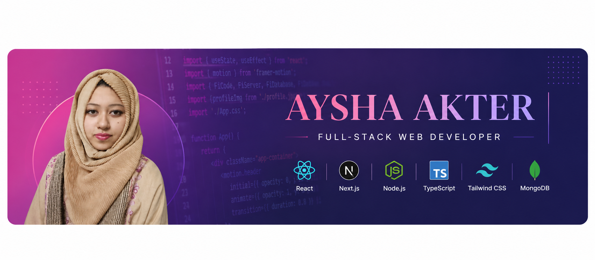

<p align="center">
  
</p>
<h1 align="center">Hi, I'm Aysha Akter</h1>

<h3 align="center">💻 Full-Stack Web Developer</h3>

<p align="center">
  Passionate about building modern, responsive, and user-friendly web applications.
</p>

---

## 👩‍💻 About Me

- 💻 Full-Stack Web Developer
- ⚛️ Building modern frontend applications with **React & Next.js**
- 🎨 Creating responsive and clean interfaces with **Tailwind CSS**
- 🤖 Using **AI-assisted development** to improve development workflows
- 🚀 Building real-world projects and continuously improving my skills

---

## 📣 FOLLOW ME ON SOCIALS:

<a href="https://www.linkedin.com/in/aysha-akter-7617a5197/" target="_blank">
  
</a>
<a href="https://discord.com/users/1292546666741629050" target="_blank">
  
</a>
<a href="https://www.pinterest.com/freelanceraysha19/">
  
</a>

---

## 🚀 Tech Stack

### 🎨 Frontend

<p>
  
</p>

**HTML • CSS • JavaScript • TypeScript • React • Tailwind CSS • Next.js**

### ⚙️ Backend

<p>
  
</p>

**Node.js • Better Auth**

### 🗄️ Database

<p>
  
</p>

**MongoDB • Mongoose**

### 🛠️ Tools & Version Control

<p>
  
</p>

**Git • GitHub • VS Code**

---

## 🤖 AI-Assisted Development

I use AI tools as part of my development workflow for:

- 💡 Prompt Engineering
- 💻 AI-Assisted Coding
- 🐛 Debugging & Problem Solving
- 🔄 Code Refactoring
- 📚 Understanding Documentation
- ⚡ Improving Development Workflows

---

## 🎯 What I Do

```javascript
const aysha = {
  role: "Full-Stack Web Developer",

  frontend: [
    "HTML",
    "CSS",
    "Tailwind CSS",
    "JavaScript",
    "TypeScript",
    "React",
    "Next.js"
  ],

  backend: [
    "Node.js",
    "Better Auth"
  ],

  database: [
    "MongoDB",
    "Mongoose"
  ],

  tools: [
    "Git",
    "GitHub",
    "VS Code"
  ],

  interests: [
    "Full-Stack Development",
    "AI-Assisted Development",
    "Building Real-World Applications"
  ]
};
```


<p></p>
